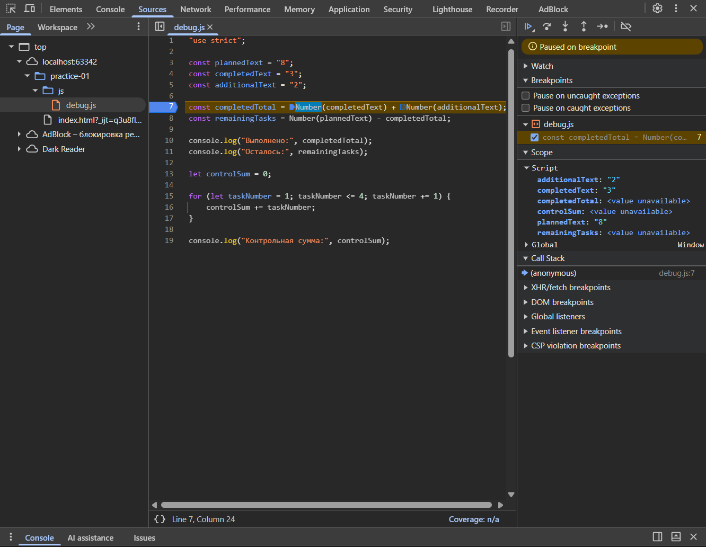

# Практическая работа № 1

**Тема: Подготовка окружения и первые программы на JavaScript**

## 1. Автор и вариант
* **Имя:** Волков Сергей Иванович
* **Группа**: ЭФБО-03-25
* **Вариант:** 5

## 2. Окружение
* **Операционная система: Windows 11
* **Версия Node.js: v25.8.2
* **Версия npm: 11.11.1
* **Версия Git: 2.45.1
* **Использованный браузер: Google Chrome

---

## 3. Запуск

Все команды выполняются из корня репозитория.

**Запуск через Node.js (терминал):**
`node practice-01/js/hello.js`
`node practice-01/js/types.js`
`node practice-01/js/progress.js`
`node practice-01/js/plan.js`
`node practice-01/js/debug.js`

**Запуск в браузере:**
1. Открыть локальный файл `practice-01/index.html` в браузере.
2. Открыть Инструменты разработчика и перейти во вкладку **Console / Консоль**.
3. Для проверки разных заданий нужно менять путь в теге ``, сохранять файл и перезагружать страницу.

---

## 4. Задание 1: Один файл — две среды выполнения

**Различие результатов:**
* При запуске в браузере последняя строка выдала: `Тип document: object`.
* При запуске через Node.js последняя строка выдала: `Тип document: undefined`.

**Объяснение:**
Браузер и Node.js — это разные среды выполнения кода. В браузере существует объект `document` для взаимодействия с веб-страницей (HTML-кодом). Node.js просто выполняет JavaScript вне браузера, он не создает HTML-страницу и не имеет браузерного DOM, поэтому объект `document` там отсутствует.

---

## 5. Задание 2: Исследование типов и преобразований

| Выражение | Ожидание до запуска | Фактическое значение | Тип результата | Объяснение |
|---|---|---|---|---|
| `"8" + 2` | `"82"` | `"82"` | `string` | Если при сложении один из операндов — строка, оператор `+` работает как объединение (конкатенация) текста. |
| `"8" - 2` | `6` | `6` | `number` | Оператор `-` работает только с числами, поэтому строка `"8"` автоматически преобразовалась в число. |
| `Number("8") + 2` | `10` | `10` | `number` | Функция `Number()` явно превратила строку `"8"` в число до сложения. |
| `"12" > "3"` | `false` | `false` | `boolean` | Строки сравниваются посимвольно. Символ `"1"` меньше, чем символ `"3"`, поэтому результат `false`. |
| `12 === "12"` | `false` | `false` | `boolean` | Оператор строгого равенства не преобразует типы. Число и строка не равны друг другу. |
| `Number("")` | `0` | `0` | `number` | По правилам JavaScript явное преобразование пустой строки в число дает `0`. |
| `Number("text")` | `NaN` | `NaN` | `number` | Текст нельзя преобразовать в число, поэтому получается специальное значение `NaN` (Not a Number). |
| `Boolean("false")` | `true` | `true` | `boolean` | Любая непустая строка при преобразовании в логический тип дает `true`. |
| `typeof null` | `"object"` | `"object"` | `string` | Значение выражения `typeof null` равно строке `"object"`. Тип самого слова `"object"` — строка (`string`). |
| `typeof NaN` | `"number"` | `"number"` | `string` | `NaN` означает «не число», но возвращает `"number"`. Тип самого слова `"number"` — строка (`string`). |

---

## 6. Задания 3 и 4: Сводка и план выполнения задач

### Задание 3. Сводка выполнения задач
| Проверка | Входные данные | Ожидаемый результат | Фактический результат | Итог |
|---|---|---|---|---|
| Обычный случай | `12`, `5` | Осталось 7; прогресс 41.7%; статус «В работе». | Осталось 7; прогресс 41.7%; статус «В работе». | Пройдено |
| Граничный случай | `0`, `0` | Сообщение «Задач пока нет», без расчёта процента. | Задач пока нет | Пройдено |
| Граничный случай | `5`, `0` | Осталось 5; прогресс 0.0%; статус «Не начато». | Осталось 5; прогресс 0.0%; статус «Не начато». | Пройдено |
| Граничный случай | `5`, `5` | Осталось 0; прогресс 100.0%; статус «Завершено». | Осталось 0; прогресс 100.0%; статус «Завершено». | Пройдено |
| Некорректные данные | `5`, `6` | Ошибка: выполнено больше, чем существует. | Ошибка: выполнено больше, чем существует. | Пройдено |
| Некорректные данные | `-1`, `0` | Ошибка: отрицательное количество. | Ошибка: отрицательное количество задач. | Пройдено |
| Некорректные данные | `5`, `2.5` | Ошибка: дробное количество. | Ошибка: дробное количество. | Пройдено |
| Некорректные данные | `"5"`, `2` | Ошибка: вместо числа передана строка. | Ошибка: вместо числа передана строка. | Пройдено |
| Некорректные данные | `1001`, `0` | Ошибка: превышена верхняя граница. | Ошибка: превышена верхняя граница. | Пройдено |
| Некорректные данные | `NaN`, `0` | Ошибка: недопустимое числовое значение. | Ошибка: недопустимое числовое значение. | Пройдено |
| Мой вариант (5) | `7`, `2` | Осталось 5; прогресс 28.6%; статус «В работе». | Осталось 5; прогресс 28.6%; статус «В работе». | Пройдено |

### Задание 4. План выполнения задач по дням
| Проверка | Входные данные | Ожидаемый результат | Фактический результат | Итог |
|---|---|---|---|---|
| Обычный случай | `12`, `5`, `3` | 3 дня; в последний день выполнена 1 задача. | 3 дня; в последний день выполнена 1 задача. | Пройдено |
| Обычный случай | `10`, `4`, `3` | 2 дня, по 3 задачи в день. | 2 дня, по 3 задачи в день. | Пройдено |
| Обычный случай | `5`, `3`, `10` | 1 день, выполнено только 2 оставшиеся задачи. | 1 день, выполнено только 2 оставшиеся задачи. | Пройдено |
| Граничный случай | `5`, `5`, `2` | 0 дней; цикл не выполняется. | 0 дней; цикл не выполняется. | Пройдено |
| Граничный случай | `0`, `0`, `2` | 0 дней; цикл не выполняется. | 0 дней; цикл не выполняется. | Пройдено |
| Некорректные данные | `5`, `2`, `0` | Ошибка; цикл не запускается. | Ошибка: дневная норма должна быть от 1 и выше. | Пройдено |
| Некорректные данные | `5`, `2`, `1.5` | Ошибка: дробной дневной нормы быть не должно. | Ошибка: дробное количество. | Пройдено |
| Некорректные данные | `5`, `6`, `2` | Ошибка: некорректное число выполненных задач. | Ошибка: некорректное число выполненных задач. | Пройдено |
| Некорректные данные | `5`, `2`, `"2"` | Ошибка: дневная норма задана строкой. | Ошибка: дневная норма или количество задач заданы строкой. | Пройдено |
| Некорректные данные | `5`, `2`, `1001` | Ошибка: превышена верхняя граница нормы. | Ошибка: превышена верхняя граница. | Пройдено |
| Мой вариант (5) | `7`, `2`, `2` | 3 дня; в последний день выполнена 1 задача. | 3 дня; в последний день выполнена 1 задача. | Пройдено |

---

## 7. Отладка

Исходный ошибочный результат программы:
* Выполнено: 32
* Осталось: -24
* Контрольная сумма: 6

| Ошибка | Что наблюдалось | Причина | Исправление | Результат после исправления |
|---|---|---|---|---|
| Обработка количества задач | Значение `completedTotal` стало равно строке `"32"` вместо числа `5`. | Оператор `+` выполнил конкатенацию (склеивание) исходных строк, а не сложение. | Исходные строки обернуты в функцию `Number()` перед вычислением. | Выполнено: 5 |
| Граница цикла | Значение `controlSum` стало равно `6` (сумма 1+2+3). | Условие `taskNumber < 4` останавливает цикл до того, как переменная станет равна 4. | Условие цикла изменено на `taskNumber <= 4`. | Контрольная сумма: 10 |

---

## 8. Вывод

В ходе практической работы я подготовил рабочее окружение (установил Node.js, Git, редактор кода). Научился запускать JavaScript в браузере и через терминал, и понял разницу между этими средами выполнения.

Были на практике освоены базовые концепции: объявление переменных (`const`, `let`), основные типы данных и их явное преобразование. Особенное внимание было уделено проверке входных данных (на тип, целочисленность и границы) с использованием условий `if...else`, а также организации работы через цикл `while`.

Наиболее показательной оказалась ошибка со сложением строк (`"3" + "2" = "32"`), так как она наглядно демонстрирует, почему важно строго контролировать типы данных и не полагаться на автоматическое преобразование. Также полезным оказался навык отладки через точки останова во вкладке Sources в DevTools браузера — это помогает находить причины неверного результата на каждом шаге выполнения.